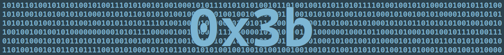
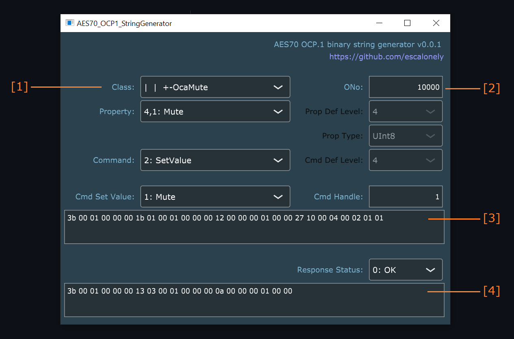

# AES70 OCP.1 Binary String Generator

The AES70 OCP.1 binary string generator is a privately created and driven project.

## Description

- This is a small tool that can generate AES70/OCA protocol data units (PDUs) for TCP-network-based control (OCP.1).
- The PDUs are generated quickly and on the fly after adjusting only a handful of parameters.
- The resulting PDUs can be used by integrators, e.g. by copy-pasting them into a script, for controlling and monitoring AES70-capable devices.

For more info in AES70 and/or OCA, visit https://ocaalliance.com/what-is-aes70/

## Quick Start

1. Start by selecting the parameters of the AES70 Command that you wish to generate.
2. Enter the unique object number (ONo) of the AES70 objct within the device.
3. Copy the resulting binary string into your integration environment so that it can be transmitted via TCP/IP to the AES70-capable device in your network.
4. Use the generated Response string to help decode the reply from the device to the above Command.

## Submodules

- JUCE: https://github.com/juce-framework/JUCE
- NanoOcp: https://github.com/ChristianAhrens/NanoOcp

